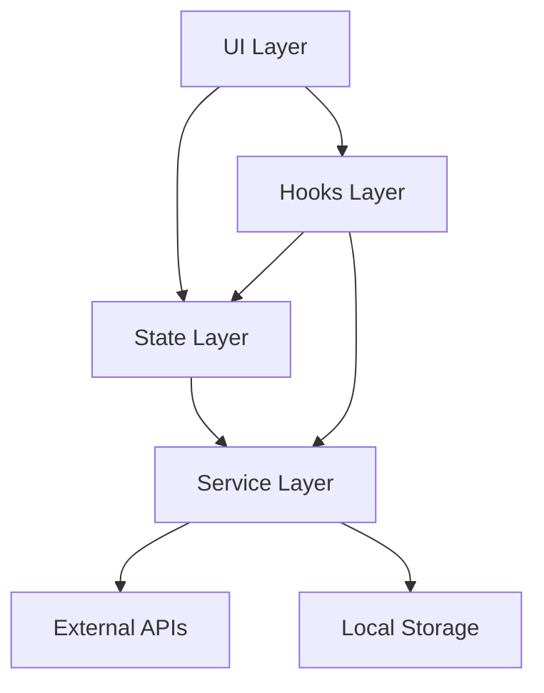

# Architecture Documentation

This document details the architectural patterns and decisions in the ShipNative boilerplate.

## Layered Architecture

The application follows a clean, layered architecture to separate concerns and improve maintainability.

### 1. UI Layer (`/app`, `/components`, `/screens`)
- **Responsibility**: Rendering UI, handling user interactions
- **Rules**:
  - No direct API calls
  - No complex business logic
  - Uses Unistyles for styling
  - Uses Hooks and Stores for data/logic

### 2. Hooks Layer (`/hooks`)
- **Responsibility**: Reusable logic, connecting UI to State/Services
- **Rules**:
  - Encapsulate side effects
  - Use React Query for data fetching
  - Composition of smaller hooks

### 3. State Layer (`/stores`)
- **Responsibility**: Global application state
- **Technology**: Zustand
- **Patterns**:
  - **Middleware**: Logging, Error Handling, Persistence
  - **Selectors**: Memoized derived state
  - **Actions**: State mutations

### 4. Service Layer (`/services`)
- **Responsibility**: External communication, heavy business logic
- **Patterns**:
  - **Service Factory**: Dependency injection and initialization
  - **Singleton**: Services are singletons
  - **Interface-based**: Easy to mock for testing

### 5. Infrastructure Layer (`/utils`, `/config`)
- **Responsibility**: Cross-cutting concerns
- **Components**:
  - **ErrorHandler**: Centralized error handling
  - **Logger**: Structured logging
  - **Config**: Environment management

## Key Subsystems

### Error Handling

We use a centralized error handling strategy to ensure consistent UX and easier debugging.

- **Categorization**: Errors are classified (Network, Auth, Validation, etc.)
- **Recovery**: Automatic retry for transient errors
- **Reporting**: Critical errors sent to Sentry
- **UX**: User-friendly messages for all errors

### Configuration Management

Configuration is type-safe and validated at runtime.

- **Env**: Type-safe access to environment variables
- **Features**: Feature flags for toggling functionality
- **Constants**: App-wide constants

### Network Monitoring

Real-time network status tracking enables robust offline support.

- **Monitoring**: Tracks connection type and quality
- **React Query Integration**: Pauses queries when offline
- **UX**: Shows offline indicators when needed

## Data Flow

### API Request Flow

1. **UI Component** calls `useQuery` hook
2. **React Query** checks cache
3. **Query Function** calls `Api` service
4. **Api Service** makes HTTP request via `apisauce`
5. **Interceptors** log request/response
6. **ErrorHandler** catches and classifies errors
7. **UI Component** receives data or error state

### State Update Flow

1. **UI Component** calls store action
2. **Middleware** logs action (dev mode)
3. **Store** updates state
4. **Middleware** persists state (if configured)
5. **Selectors** recompute derived state
6. **UI Component** re-renders with new state

## Testing Strategy

- **Unit Tests**: Utilities, Hooks, Stores
- **Integration Tests**: Services, Complex Flows
- **E2E Tests**: Critical User Journeys (Maestro)
- **Component Tests**: UI Components (RNTL)

## Code Generation

We use scripts to generate boilerplate code and ensure consistency.

- `node scripts/generate/component.js`
- `node scripts/generate/screen.js`
- `node scripts/generate/store.js`
